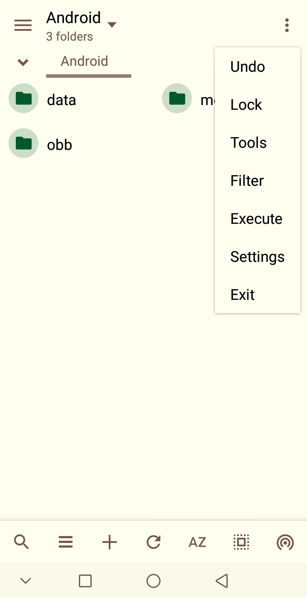

A clean, light theme for Mixplorer, drawing inspiration from the aesthetics of SolidExplorer.

## Usage Instructions
1. Launch Mixplorer.
2. Navigate to the folder containing the *.mic* file from this repository.
3. Tap on the file and select *Import*.
4. Enjoy your new theme!

## Gallery

    

